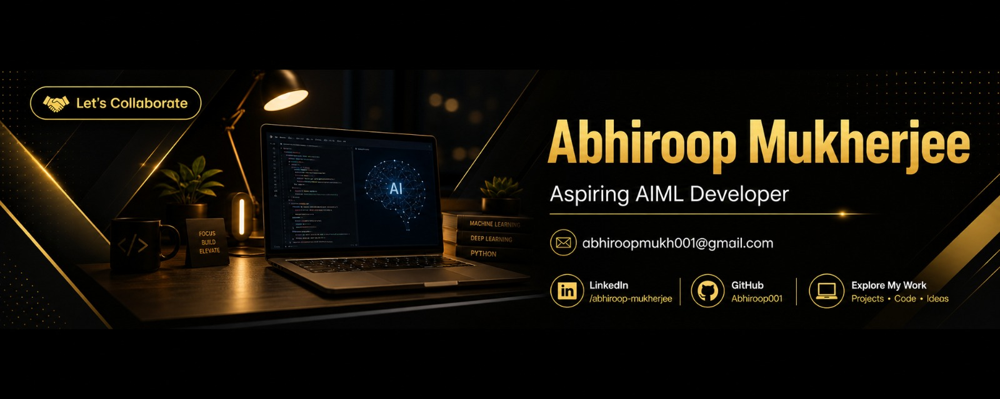

<!-- BANNER -->

  

<h1 align="center">Abhiroop Mukherjee</h1>

  

  <strong>AI/ML Engineer (Aspiring) | Real-Time Intelligent Systems</strong> 
  Computer Vision • NLP • FastAPI • React

  📍 Howrah, India &nbsp;&nbsp;|&nbsp;&nbsp;
  📧 abhiroopmukh001@gmail.com &nbsp;&nbsp;|&nbsp;&nbsp;
  <a href="https://github.com/Abhiroop001">GitHub</a> • 
  <a href="https://www.linkedin.com/in/abhiroop-mukherjee-39719a2b8">LinkedIn</a>

---

## Profile

B.Tech Information Technology student with a CGPA of **9.53**, specializing in **AI/ML systems, backend engineering, and full-stack development**.

Focused on building **real-time, scalable AI solutions** using **Computer Vision, Deep Learning, NLP, FastAPI, and React**, with strong emphasis on **practical implementation and problem-solving**.

---

## Key Projects

### Emergi-Sensei — AI-Based Accident & Fire Detection System
- Designed real-time detection pipeline using **CNN-based Computer Vision**
- Built backend services using **FastAPI for real-time alerting**
- Achieved **3rd Place** at Inter-College Hackathon

### CEREVOLT — Neurocognitive Rehabilitation Platform
- Developed AI-powered system for **cognitive skill enhancement**
- Integrated **interactive learning with machine learning models**
- Selected among **Top 500 (Vishwakarma Awards, IIT Indore)**

### KaWatch — Rockfall Prediction & Safety System
- Built prediction models using **Deep Learning and Computer Vision**
- Designed real-time alert system for **industrial safety use cases**
- Research presented at **Regional Science & Technology Congress**

### Automated Data Science Agent
- Developed **multi-agent AI system** for automated data analysis
- Features include **EDA automation and anomaly detection**
- Advanced to **Intel Unnati GenAI Round 2**

### RECYCLE-ME — E-Waste Management Platform
- Built backend system using **Node.js**
- Focused on **sustainable electronic waste management**
- Secured **3rd Position** in technical presentation

---

## Experience

**MERN Stack Developer Intern**  
Euphoria Genx | 2025  

**Python Developer Intern**  
Encryptrix | 2024  

---

## Technical Skills

**Languages**  
C, C++, Python, Java, R  

**AI / ML**  
Machine Learning, Deep Learning, Computer Vision, NLP  

**Backend & Web**  
FastAPI, Node.js, React, HTML, CSS, JavaScript  

**Databases**  
MySQL, MongoDB, Oracle, SQLite  

**Core Concepts**  
Data Structures & Algorithms, System Design, Data Analysis  

---

## GitHub Analytics

  

---

## Professional Focus

- Real-time AI system development  
- Multimodal AI (Vision + NLP)  
- Scalable backend architecture  
- Applied machine learning  

---

  <i>Focused on building systems that translate AI into real-world impact.</i>

